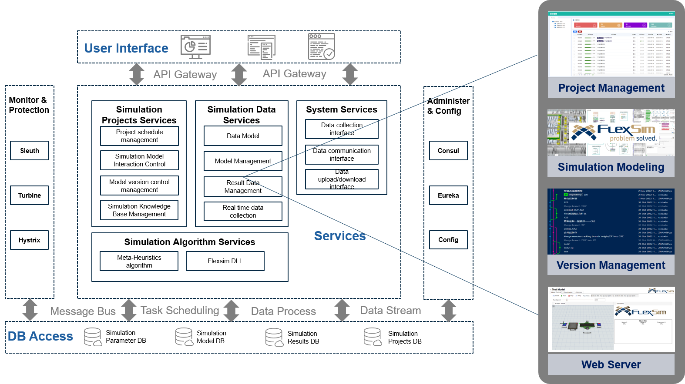
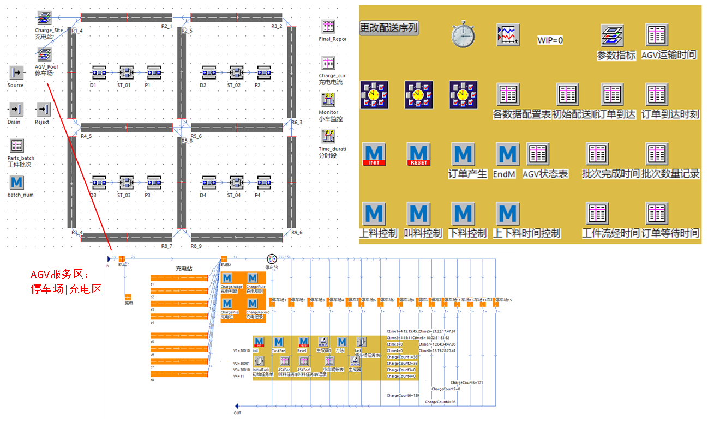
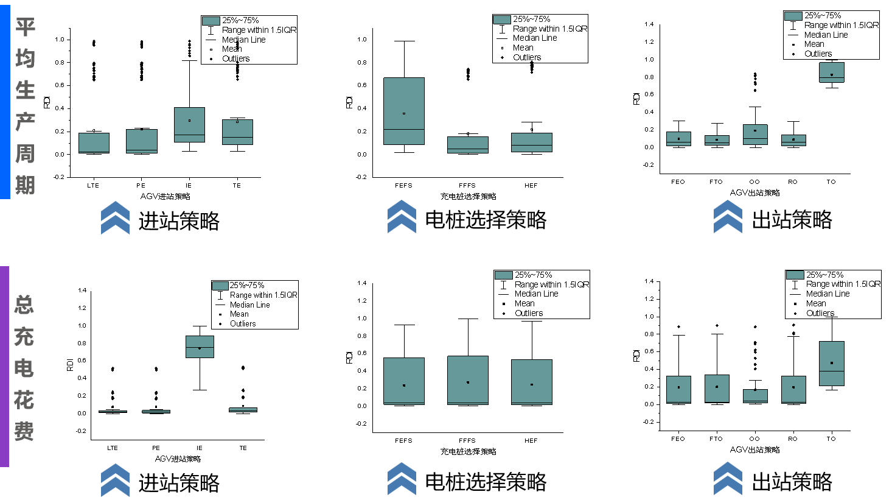
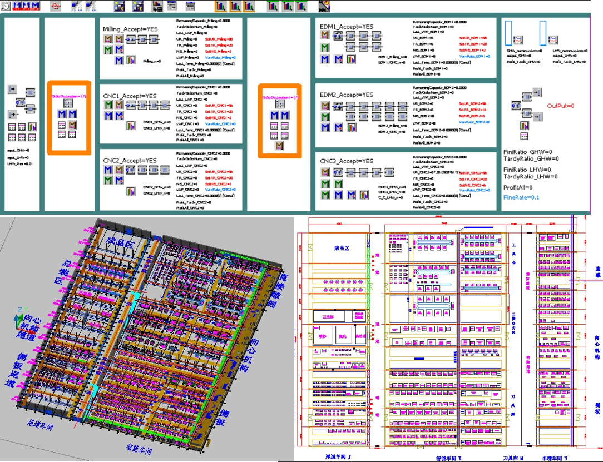

<!-- 
  You can also find my articles on <u><a href="{{author.googlescholar}}">my Google Scholar profile</a>.</u>





  
 -->

<h2><ion-icon name="pricetags-outline"></ion-icon> Current Projects</h2>
-----  
<b>Design and Development of Factory Production Simulation Management System</b>  
_**2023.06-Present**_  

* By adopting cloud storage and computing technology, we can address the issue of dispersed simulation data resources, achieve centralized data management, and maximize data sharing and reusability.
* We provide modeling process templates and customized libraries for lithium battery workshops to enable parameterized and rapid modeling
* We leverage Git version control and project management technologies to address the challenges of collaborative simulation modeling across multiple individuals and locations for medium to large-scale projects. Additionally, we customize and develop simulation optimization algorithm modules tailored to specific business scenarios, enhancing our capability to solve complex practical problems.
* **Expected Benefit:** improved the efficiency of simulation modelling by 40%, about &#36; 55~63k cost save per year, ROI(0.65)

The architecture of factory production simulation management system

  
<h2><ion-icon name="time-outline"></ion-icon> Past Research</h2>  
-----  
<b>Master’s Dissertation: Optimisation of AGV System Guide-path Network Layout Considering Congestion Factors</b>  
_**2020.11-2022.06**_  
Based on the current layout of the machining workshop of a customized equipment intelligent manufacturing enterprise, it is proposed to first design an AGV guidance path network with a flexible structure. The aim is to reduce the probability of AGV operation congestion in the workshop during the planning stage, reduce the difficulty and complexity of subsequent AGV scheduling stages, and improve logistics transportation efficiency.  
Establish a mathematical model for the k-arc strongly connected guidance path network in the machining workshop, and first use the existing VNS algorithm to solve its problem. Then, improve the VNS algorithm and propose a solution algorithm based on adaptive large neighborhood search algorithm(ALNS). The experimental results show that the solution performance of this algorithm is better than that of the VNS algorithm.  

  
  

Comparison of topology of AGV guide-path between current solution and ALNS solution
  

The simulation model of optimal 2-arc strong connect layout base on ALNS

   

<b>Stochastic Flexible Layout optimization of Intelligent Workshop with Unidirectional Multiple Closed Loop AGVs</b>  
_**2019.10-2022.01**_  
_Funded by the National Natural Science Foundation of China, No. 51775120_  
_Ning Mao, Qinxin Chen, Huiyu Zhang, Yong Liao, Xuanrui Chen, Rongze Cai_
* **Key responsibilities:** studied the latest theories of workshop layout planning, based on which I optimized the underlying guide-path network topology design of the automated guided vehicle (AGV) to achieve a more flexible workshop.

<b>Research and Development of an Intelligent Workshop AGV Dispatching System</b>  
_**2020.11-2021.08**_  
_School-enterprise cooperation project_  
_Ning Mao, Rongze Cai, Changwei Hu, Feichuang Fang_
* **Key responsibilities:** lucubrated the AGV charging strategy of the machining workshop, constructed the simulation model of the workshop using the software Plant Simulation, and conducted simulation experiments to verify the model by designing different charging strategies.  
* **Result:** increased the AGV transport efficiency by 30% and reduced the electricity cost by 5%.  

  
  

Multi AGV Charging Strategy for Job Shop Based on Time of Use Electricity Price Considering Limited Electricity Constraints
  

<b>Development of Robot Intelligent Factory Layout Designning System</b>  
_**2019.12-2020.09**_  
_School-enterprise cooperation project_  
_Ning Mao, Huiyu Zhang, Yong Liao, Xuanrui Chen, Rongze Cai, Ting Deng_  
* **Key responsibilities:** researched the network topology design of AGV guide-path and addressed the AGV congestion problems
* **Result:** A set of workshop layout planning and design systems were created based on the production characteristics of the enterprise in a bid to endow the enterprise with the rapid layout ability  

Facility layout design with simulation model

